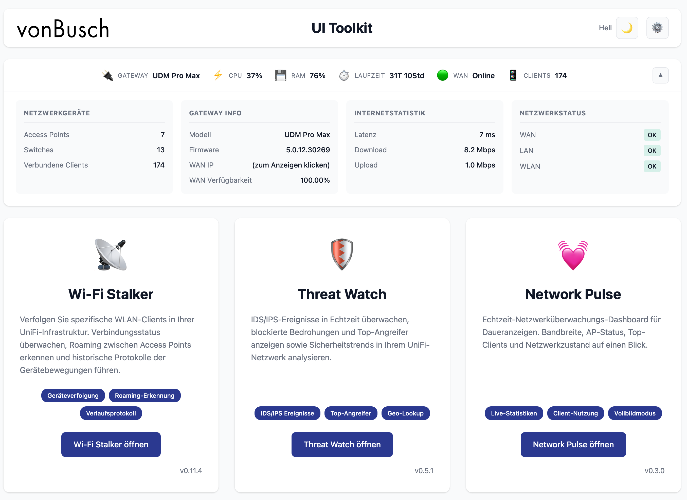
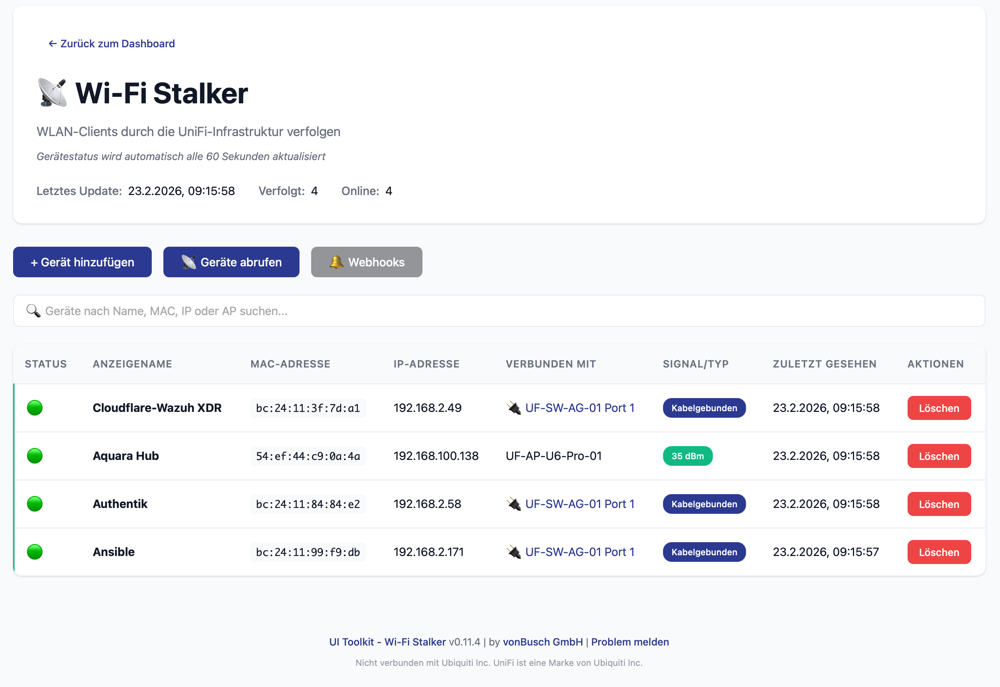
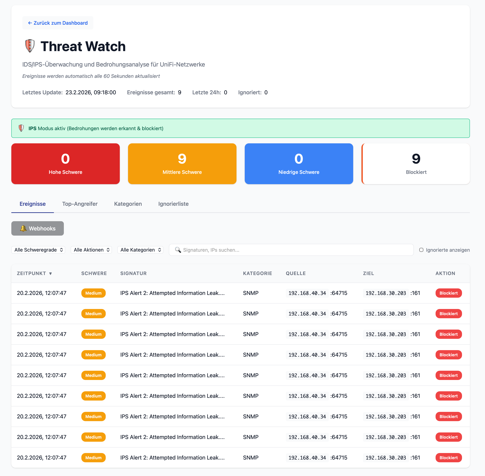
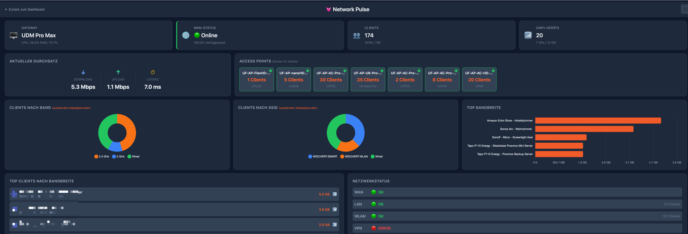

# UI Toolkit

Eine umfassende Suite von Tools für das UniFi-Netzwerkmanagement und -monitoring.

> **Hinweis:** Dieses Projekt ist nicht mit Ubiquiti Inc. verbunden, wird von Ubiquiti Inc. weder befürwortet noch gesponsert. UniFi ist eine Marke von Ubiquiti Inc.



## Funktionen

### Dashboard

Echtzeit-Systemstatus mit:

* **Gateway-Info** – Modell, Firmware, Laufzeit
* **Ressourcenauslastung** – CPU- und RAM-Nutzung
* **Netzwerkstatus** – WAN, LAN, WLAN, VPN-Status mit Diagnosegründen
* **Verbundene Clients** – Kabelgebundene und WLAN-Anzahl
* **WAN-Status** – IP, ISP, Latenz, Verfügbarkeit (Multi-WAN unterstützt)

### Wi-Fi Stalker

Verfolge bestimmte WLAN-Geräte durch deine UniFi-Infrastruktur.

* Geräteverfolgung per MAC-Adresse
* Roaming-Erkennung zwischen Access Points
* Verbindungsverlauf mit Zeitstempeln
* Geräte direkt über die Oberfläche sperren/freischalten
* Anzeige gesperrter Geräte in der Geräteliste
* Webhook-Benachrichtigungen (Slack, Discord, n8n) für Verbindung, Trennung, Roaming, Sperrung und Freischaltung



### Threat Watch

Überwacht IDS/IPS-Sicherheitsereignisse deines UniFi-Gateways.

* Echtzeit-Ereignisüberwachung
* Bedrohungskategorisierung und -analyse
* Top-Angreifer und Ziele
* Webhook-Benachrichtigungen (Slack, Discord, n8n)



### Network Pulse

Echtzeit-Netzwerküberwachungs-Dashboard.

* Gateway-Status (Modell, Firmware, Laufzeit, WAN)
* Gerätezahlen (Clients gesamt, kabelgebunden, WLAN, APs, Switches)
* Chart.js-Visualisierungen (Clients nach Band, Clients nach SSID, Top-Bandbreite)
* Klickbare AP-Karten mit detaillierten Client-Ansichten
* WebSocket-basierte Live-Updates



### UI Product Selector *(Extern)*

Baue dein perfektes UniFi-Netzwerk auf [uiproductselector.com](https://uiproductselector.com)

---

## Schnellstart

### Voraussetzungen

* **Docker** (empfohlen) oder Python 3.9–3.12
* **Ubuntu 22.04/24.04** (oder anderes Linux)
* Zugriff auf den UniFi Controller

### Lokale Installation (nur LAN)

Keine Authentifizierung, Zugriff über `http://localhost:8000`

**Voraussetzung:** Docker installieren – siehe [docs/INSTALLATION.md](docs/INSTALLATION.md#option-a-docker-installation-recommended)

```bash
# Klonen und einrichten
git clone https://github.com/Crosstalk-Solutions/unifi-toolkit.git
cd unifi-toolkit
./setup.sh  # Option 1 für Lokal wählen

# Starten
docker compose up -d
```

Aufruf unter **http://localhost:8000**

### Produktiv-Installation (Internetzugang)

Authentifizierung aktiviert, HTTPS mit Let's Encrypt via Caddy

**Voraussetzung:** Docker installieren – siehe [docs/INSTALLATION.md](docs/INSTALLATION.md#option-a-docker-installation-recommended)

```bash
# Klonen und einrichten
git clone https://github.com/Crosstalk-Solutions/unifi-toolkit.git
cd unifi-toolkit
./setup.sh  # Option 2 für Produktion wählen
# Eingabe: Domain, Admin-Benutzername, Passwort

# Firewall-Ports öffnen
sudo ufw allow 80/tcp && sudo ufw allow 443/tcp

# Mit HTTPS starten
docker compose --profile production up -d
```

Aufruf unter **https://deine-domain.de**

---

## Dokumentation

| Anleitung | Beschreibung |
| --- | --- |
| [INSTALLATION.md](docs/INSTALLATION.md) | Vollständige Installationsanleitung mit Fehlerbehebung |
| [SYNOLOGY.md](docs/SYNOLOGY.md) | Synology NAS Container Manager Einrichtung |
| [QNAP-Anleitung](https://github.com/Crosstalk-Solutions/unifi-toolkit/issues/29) | QNAP Container Station Einrichtung (Community) |
| [QUICKSTART.md](docs/QUICKSTART.md) | 5-Minuten-Schnellstart-Referenz |

---

## Häufige Befehle

| Aktion | Befehl |
| --- | --- |
| Starten (lokal) | `docker compose up -d` |
| Starten (Produktion) | `docker compose --profile production up -d` |
| Stoppen | `docker compose down` |
| Logs anzeigen | `docker compose logs -f` |
| Neustart | `docker compose restart` |
| Passwort zurücksetzen | `./reset_password.sh` |
| Aktualisieren | `./upgrade.sh` |

---

## Konfiguration

### Einrichtungsassistent (Empfohlen)

Den interaktiven Einrichtungsassistenten starten:

```bash
./setup.sh
```

Der Assistent führt durch:

* Generierung des Verschlüsselungsschlüssels
* Konfiguration des Bereitstellungsmodus (lokal/Produktion)
* Einrichtung der Authentifizierung (nur Produktion)
* Erstellung der `.env`-Datei

### Manuelle Konfiguration

Beispielkonfiguration kopieren und bearbeiten:

```bash
cp .env.example .env
```

#### Pflichteinstellungen

| Variable | Beschreibung |
| --- | --- |
| `ENCRYPTION_KEY` | Verschlüsselt gespeicherte Zugangsdaten (wird vom Einrichtungsassistenten generiert) |

#### Bereitstellungseinstellungen (nur Produktion)

| Variable | Beschreibung |
| --- | --- |
| `DEPLOYMENT_TYPE` | `local` oder `production` |
| `DOMAIN` | Deine Domain (z. B. `toolkit.example.com`) |
| `AUTH_USERNAME` | Admin-Benutzername |
| `AUTH_PASSWORD_HASH` | Bcrypt-Passwort-Hash (wird vom Einrichtungsassistenten generiert) |

#### UniFi Controller Einstellungen

Konfigurierbar über `.env` oder die Web-Oberfläche (Web-Oberfläche hat Vorrang):

| Variable | Beschreibung |
| --- | --- |
| `UNIFI_CONTROLLER_URL` | Controller-URL (z. B. `https://192.168.1.1`) |
| `UNIFI_USERNAME` | Benutzername (ältere Controller) |
| `UNIFI_PASSWORD` | Passwort (ältere Controller) |
| `UNIFI_API_KEY` | API-Schlüssel (UniFi OS: UDM, UCG, Cloud Key) |
| `UNIFI_SITE_ID` | Site-ID aus der URL, nicht der Anzeigename (Standard: `default`). Bei mehreren Sites die ID aus `/manage/site/{id}/...` verwenden |
| `UNIFI_VERIFY_SSL` | SSL-Überprüfung (Standard: `false`) |

#### Tool-Einstellungen

| Variable | Beschreibung |
| --- | --- |
| `STALKER_REFRESH_INTERVAL` | Aktualisierungsintervall für Geräte in Sekunden (Standard: `60`) |

---

## Sicherheit

### Authentifizierung

* **Lokaler Modus**: Keine Authentifizierung (nur vertrauenswürdiges LAN)
* **Produktionsmodus**: Sitzungsbasierte Authentifizierung mit Bcrypt-Passwort-Hashing
* **Rate-Limiting**: 5 fehlgeschlagene Anmeldeversuche = 5 Minuten Sperre

### HTTPS

Produktiv-Installationen nutzen Caddy für automatisches HTTPS:

* Let's Encrypt-Zertifikate (automatische Erneuerung)
* HTTP-zu-HTTPS-Weiterleitung
* Sicherheits-Header (HSTS, X-Frame-Options usw.)

### Multi-Site-Netzwerk

Bei der Verwaltung mehrerer UniFi-Sites immer Site-to-Site-VPN verwenden:

```
✅ EMPFOHLEN: VPN-Verbindung
┌──────────────────┐         ┌──────────────────┐
│  UI Toolkit      │◄──VPN──►│  Entfernter      │
│  Server          │         │  UniFi Controller│
└──────────────────┘         └──────────────────┘

❌ VERMEIDEN: Direkte Internetexposition
UniFi Controller niemals per Port-Weiterleitung exponieren
```

**VPN-Optionen:** UniFi Site-to-Site, WireGuard, Tailscale, IPSec

---

## Fehlerbehebung

### Keine Verbindung zum UniFi Controller

* `UNIFI_VERIFY_SSL=false` für selbstsignierte Zertifikate setzen
* UniFi OS-Geräte (UDM, UCG) benötigen einen API-Schlüssel, kein Benutzername/Passwort
* Netzwerkkonnektivität zum Controller prüfen

### Gerät wird nicht als online angezeigt

* 60 Sekunden auf den nächsten Aktualisierungszyklus warten
* MAC-Adress-Format prüfen
* Sicherstellen, dass das Gerät im UniFi Dashboard verbunden ist

### Let's Encrypt-Zertifikat schlägt fehl

* Sicherstellen, dass der DNS-A-Record auf den Server zeigt
* Ports 80 und 443 müssen geöffnet sein
* Caddy-Logs prüfen: `docker compose logs caddy`

### Bei Anmeldung gesperrt

* 5 Minuten warten, bis die Sperre abläuft
* `./reset_password.sh` verwenden, wenn das Passwort vergessen wurde

### Docker-Probleme

* Sicherstellen, dass `.env` existiert und `ENCRYPTION_KEY` enthält
* Logs prüfen: `docker compose logs -f`
* Neuestes Image laden: `docker compose pull && docker compose up -d`

---

## Mit Python ausführen (Alternative zu Docker)

```bash
# Repository klonen
git clone https://github.com/Crosstalk-Solutions/unifi-toolkit.git
cd unifi-toolkit

# Virtuelle Umgebung erstellen (nur Python 3.9–3.12, NICHT 3.13+)
python3 -m venv venv
source venv/bin/activate

# Abhängigkeiten installieren
pip install -r requirements.txt

# Einrichtungsassistenten starten
./setup.sh

# Anwendung starten
python run.py
```

---

## Projektstruktur

```
unifi-toolkit/
├── app/                    # Hauptanwendung
│   ├── main.py            # FastAPI-Einstiegspunkt
│   ├── routers/           # API-Routen (Auth, Konfiguration)
│   ├── static/            # CSS, Bilder
│   └── templates/         # HTML-Templates
├── tools/                 # Einzelne Tools
│   ├── wifi_stalker/      # Wi-Fi Stalker Tool
│   ├── threat_watch/      # Threat Watch Tool
│   └── network_pulse/     # Network Pulse Tool
├── shared/                # Gemeinsame Infrastruktur
│   ├── config.py          # Einstellungsverwaltung
│   ├── database.py        # SQLAlchemy-Einrichtung
│   ├── unifi_client.py    # UniFi API-Wrapper
│   └── crypto.py          # Zugangsdaten-Verschlüsselung
├── docs/                  # Dokumentation
├── data/                  # Datenbank (wird zur Laufzeit erstellt)
├── setup.sh               # Einrichtungsassistent
├── upgrade.sh             # Aktualisierungsskript
├── reset_password.sh      # Passwort-Reset-Tool
├── Caddyfile              # Reverse-Proxy-Konfiguration
├── docker-compose.yml     # Docker-Konfiguration
└── requirements.txt       # Python-Abhängigkeiten
```

---

## Entwicklung

### Tests ausführen

Das Projekt enthält eine umfassende Testsuite für Authentifizierung, Caching, Konfiguration und Verschlüsselung.

```bash
# Entwicklungsabhängigkeiten installieren
pip install -r requirements-dev.txt

# Alle Tests ausführen
pytest tests/ -v

# Bestimmte Testdatei ausführen
pytest tests/test_auth.py -v

# Mit Abdeckungsbericht ausführen
pytest tests/ --cov=shared --cov=app -v
```

**Testmodule:**

* `tests/test_auth.py` – Authentifizierung, Sitzungsverwaltung, Rate-Limiting (22 Tests)
* `tests/test_cache.py` – In-Memory-Caching mit TTL-Ablauf (18 Tests)
* `tests/test_config.py` – Pydantic-Einstellungen und Umgebungsvariablen (13 Tests)
* `tests/test_crypto.py` – Fernet-Verschlüsselung für Zugangsdaten (15 Tests)

---

## Support

* **Community**: [#unifi-toolkit auf Discord](https://discord.com/invite/crosstalksolutions)
* **Fehler melden**: [GitHub Issues](https://github.com/Crosstalk-Solutions/unifi-toolkit/issues)
* **Dokumentation**: [docs/](docs/)

### Unterstützung zeigen

Wenn dir das UI Toolkit nützlich ist, kannst du die Entwicklung unterstützen:

[](https://ko-fi.com/crosstalk)

---

## Danksagungen

Entwickelt von [Crosstalk Solutions](https://www.crosstalksolutions.com/)

* YouTube: [@CrosstalkSolutions](https://www.youtube.com/@CrosstalkSolutions)

---

## Lizenz

MIT-Lizenz
